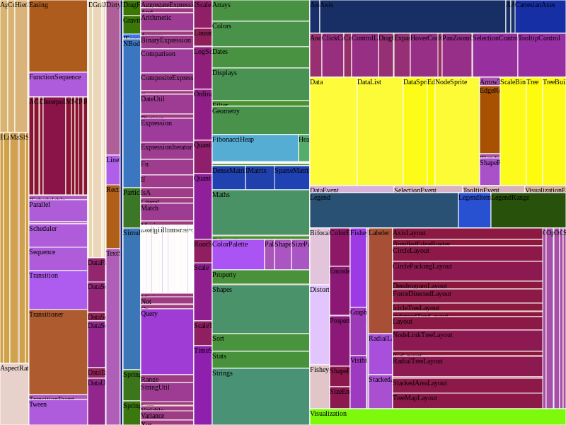

## The Making of a Tree-Map using [Go](https://golang.org)

This article walks through the why of **Tree-Maps** for visualizing hierarchical data - think **file system**, especially the sort where size or weight of each leaf node is of peculiar interest. It then discusses the process of building a Tree-Map program using Go, explaining some of the thought processes that along the way. This was an enjoyable weekend exercise achieved in about 5 iterative steps.

### Content
- Why TreeMap
- The Treemap Algorithm / Slice and Dice
- Implementing Treemap in Go
- Outcome with test data

### Why Treemap
A breakdown from the paper by [Ben Shneiderman](http://www.cs.umd.edu/~ben/) and Brian Johnson in 1991 describes Tree-Maps as a novel method for visualization of hierarchically structured information. A technique that makes use of 100% of the available display space, mapping the full hierarchy onto a rectangular region in a space-filling manner.
Familiar examples are: directory structures, internet addressing, computer programs and so on.
Tree-Maps are able to depict both the structure and content of the hierarchy, but most importantly the approach taken for Tree-Maps is well suited to hierarchies in which the content of the leaf nodes and the structure of the hierarchy are of primary importance, and the content information associated with the internal nodes is largely derived from their children.

You can find the full paper [here](https://www.cs.umd.edu/~ben/papers/Johnson1991Tree.pdf). Going through it will give details about the whole motivation behind Tree-Maps.

However a typical problem can be presented using a file system. How do you find the answer to questions such as: **Why is my disk full?, What file is consuming the largest space?, What file is the oldest?, etc.** and yet not scroll through a long list of files, opening and closing subdirectories intensively. An answer can be found in Tree-Maps.


### The Tree-Map Algorithm / Slice and Dice
An analogy to quickly illustrate the `Slice and Dice` algorithm again uses the file system. if the hard disk drive were a large, flat rectangular cake *(the original authors used cheese)*, one could certainly slice it into chunks representing the size of each top level directory. Applying this slice recursively to each piece of cake, and rotating the slicing direction `90deg` at each recursive step, would result in the Tree-Map.

Using this analogy, we would here, write a Tree-Map in the Go programming language. Keep in mind the following properties of a Tree-Map that would guide this process. You can imagine using these properties against writing a test, for each of the properties, if any isn't met, then the result is not a Tree-Map.

`Properties of a Tree-map`

- if Node1 is an ancestor of Node2, then the bounding box of Node1 completely encloses, or is equal to, the bounding box of Node2
- The bounding boxes of two nodes intersect if and only if one node is an ancestor of the other.
- Nodes occupy a display area strictly proportional to their weight.
- The weight of a node is greater than or equal to the sum of its children.


A sample of the outcome for the sample data looks like this:
<div style="text-align:center">
    
</div>


### Implementing Tree-Map in Go

The complete code can be found [here](https://github.com/willpoint/treemap).

#### Step 1

Define the structure that represents the data

`snippet 1`

```go
// TNode is a treemap node
type TNode struct {
    Name        string   `json:"name"`
    Size        float64  `json:"size,omitempty"`
    Children    []*TNode `json:"children,omitempty"`

    color       string
    orientation string
    depth       int
    bound       image.Rectangle
}
```

Note the bound which is a `image.Rectangle` type from the Go standard library. We would also use the type `image.Point` to the represent the (x,y) coordinates of the rectangle for each node.

### Step 2

Define methods that would operate on this type: **size()**. To simplify methods that would require visiting all nodes, we first define a helper function: `each([]*TNode, before, after func(t *TNode))` that takes a slice of nodes and runs the given function before and after visiting each node. Armed with that we then define `size()` a method on *TNode that gets the size for each node visited until all nodes down the tree are visited.

```go
// each runs the provided before and after functions
// recursively for each node in the tree
func each(nn []*TNode, before, after func(t *TNode)) {
    for _, c := range nn {
        if before != nil {
            before(c)
        }
        if c.Children != nil {
            each(c.Children, before, after)
        }
        if after != nil {
            after(c)
        }
    }
}

func (t *TNode) size() float64 {
    var sum float64
    each(
        []*TNode{t},
        func(n *TNode) { sum += n.Size },
        nil,
    )
    return sum
}
```

### Step 3

This block of code is at the heart of the Slice and Dice algorithm. A peek at the repository would show the complete code. A comment section of the code in the **drawTree** method would give a better idea of what this method does.

```go
if t.orientation == HORIZONTAL {
    // slicing would be along y-axis
    // x values may not be touched ?
    // proportion to consume is c.size / mSize
    // `consumed` will tell the determine the offset
    // to start new consumption
    // `proportion` tells the unit of width(x-axis)
    // or height(y-axis) to consume
    //
    // parent bound is (x0, y0)-(x1, y1)
    //
    // (x0, y0)	            (x1, y0)
    //    +--------------------+
    //	  |                    |
    //	  |                    |
    //	  |                    |
    //	  |                    |
    //	  |                    |
    // 	  +--------------------+
    //	(x0, y1)            (x1, y1)
    //
    // set values for all points in the rect
    // x0 -> parentX0
    // x1 -> parentX1
    // y0 -> parentY0 + consumed
    // y1 -> parentY0 + consumed + proportion
    proportion = (c.size() / mSize) * float64(t.bound.Dy())
    x0 := t.bound.Min.X
    x1 := t.bound.Max.X
    y0 := t.bound.Min.Y + int(consumed+0.5)
    y1 := t.bound.Min.Y + int(consumed+0.5) + int(proportion+0.5)
    min := image.Point{x0, y0}
    max := image.Point{x1, y1}
    bound = image.Rectangle{min, max}
} else {
    // do the inverse - slice along the x-axis
}
```
The function signature for drawTree also reveals a few things about our dependencies. Right now, it takes a type from a third party svg library by [Anthony Starks](https://github.com/ajstarks/svgo) to draw the svg nodes, and a maxdepth parameter to know how deep into the tree should be drawn, `0` means to till the leave nodes are reached.


### Step 4

Define our color model - so understanding the hierarchical structure at a glance becomes easy.

To do this, we use the RGB color model. The defined go type for this is:
```go
type rgb struct {
    r, g, b uint8 // as the range is between [0, 255]
}
```
Then an rgb constructor and a method that given any integer returns a string in the form `rgb(#, #, #)` where # represents the weight of the rgb component.
```go
// newRgb create a new color model
// ANDing the provided parameters with 0xff(255) so it does not
// exceed the 255
func newRgb(r, g, b int) rgb {
    return rgb{
        r: uint8(r & 0xff),
        g: uint8(g & 0xff),
        b: uint8(b & 0xff),
    }
}

// String implements Stringer interface and returns
// the svg color notation for a node in the form
// rgb(#, #, #) where # is the corresponding componenent value
func (c rgb) String() string {
    return "rgb(" +
        itoa(c.r) + "," +
        itoa(c.g) + "," +
        itoa(c.b) + ")"
}
```
### Step 5
Define flag variables to ensure default data is available and can be easily adjusted from the command line. An added benefit of printing a help string  when certain parameters are missing when the binary is executed. An example of the flag variable for the output is:
```go
outfile := flag.String("out", "output.svg", "filename to save the output data")
```

### Outcome

The outcome when running the test data in the expected shape can be seen in the colorful image above.
Try this out or clone the repository to see how it works if it excites you as it did me. There have been some other works done to improve on the slice and dice method, an example is that called `squarification`. This method tesselates the rectangle recursively into rectangles such that their aspect-ratios approach `1` as close as possible producing rectangles that look more like squares. Although this method makes it easier to better compare leaf nodes, it sacrifices the structure of the hierarchy so at a glance you cannot say how many children `nodes` a particular `node` has.
